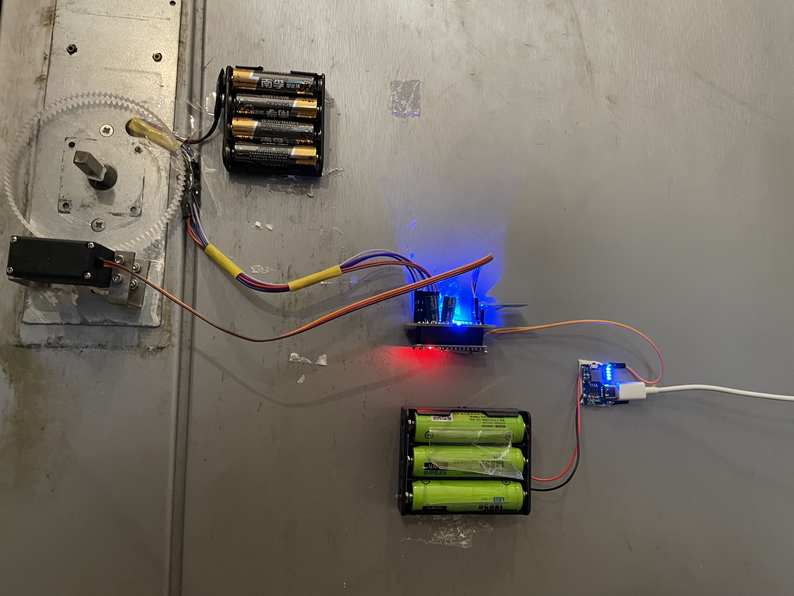
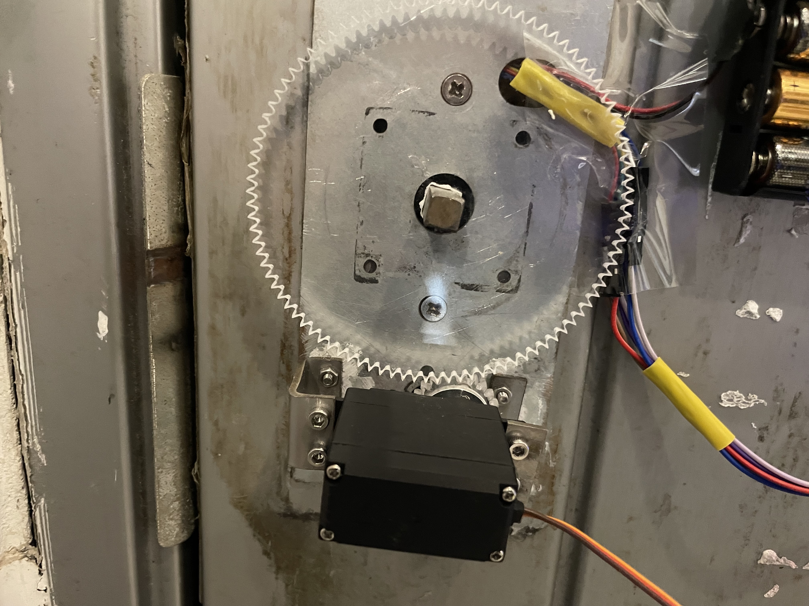
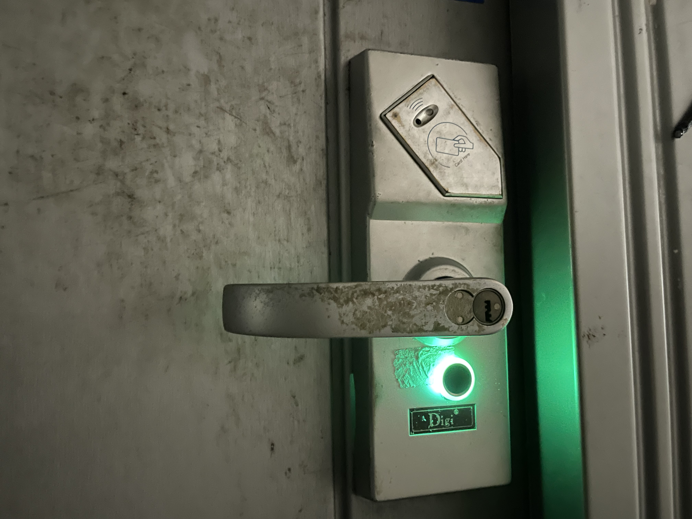
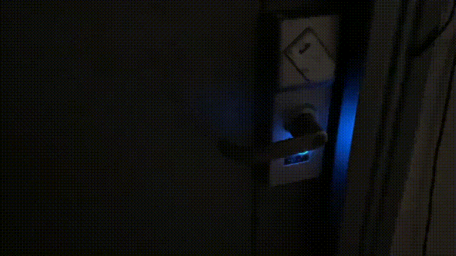
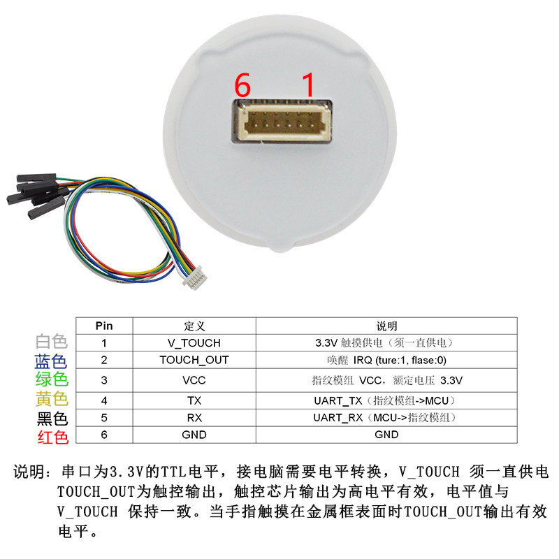
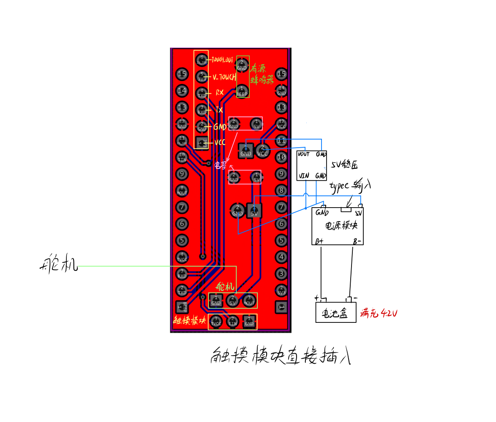
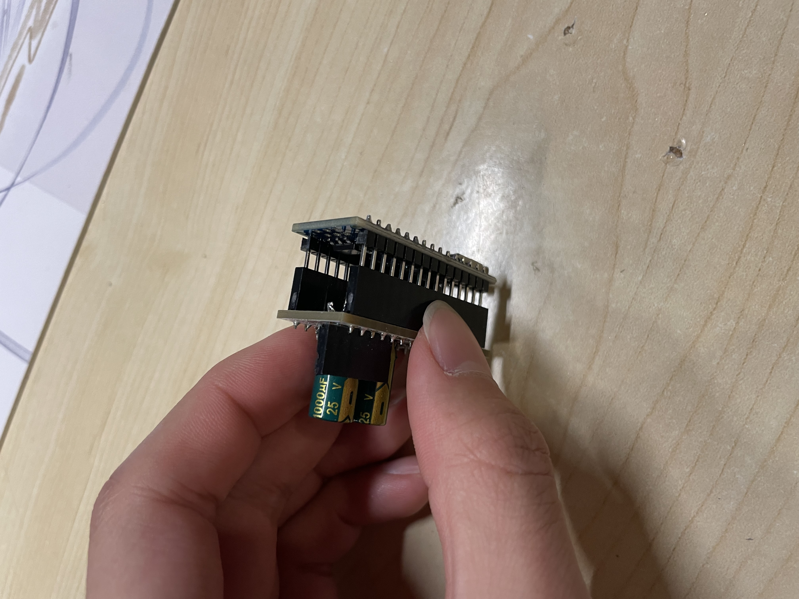
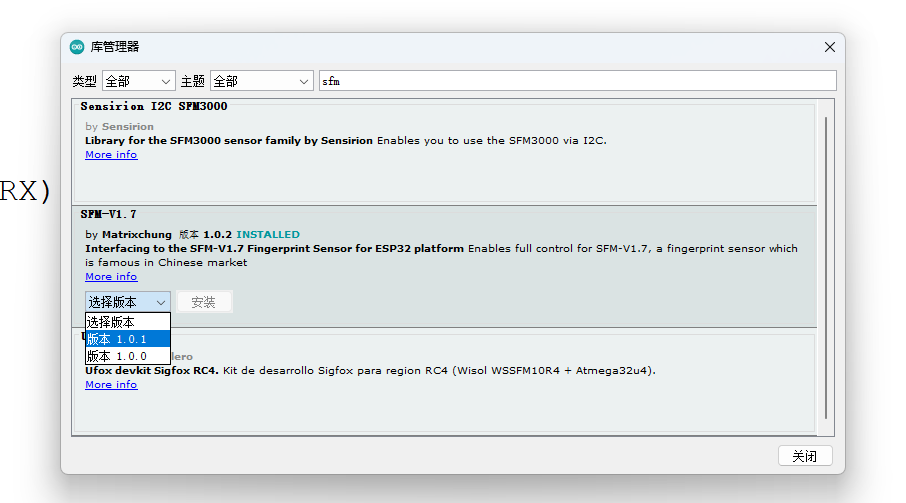
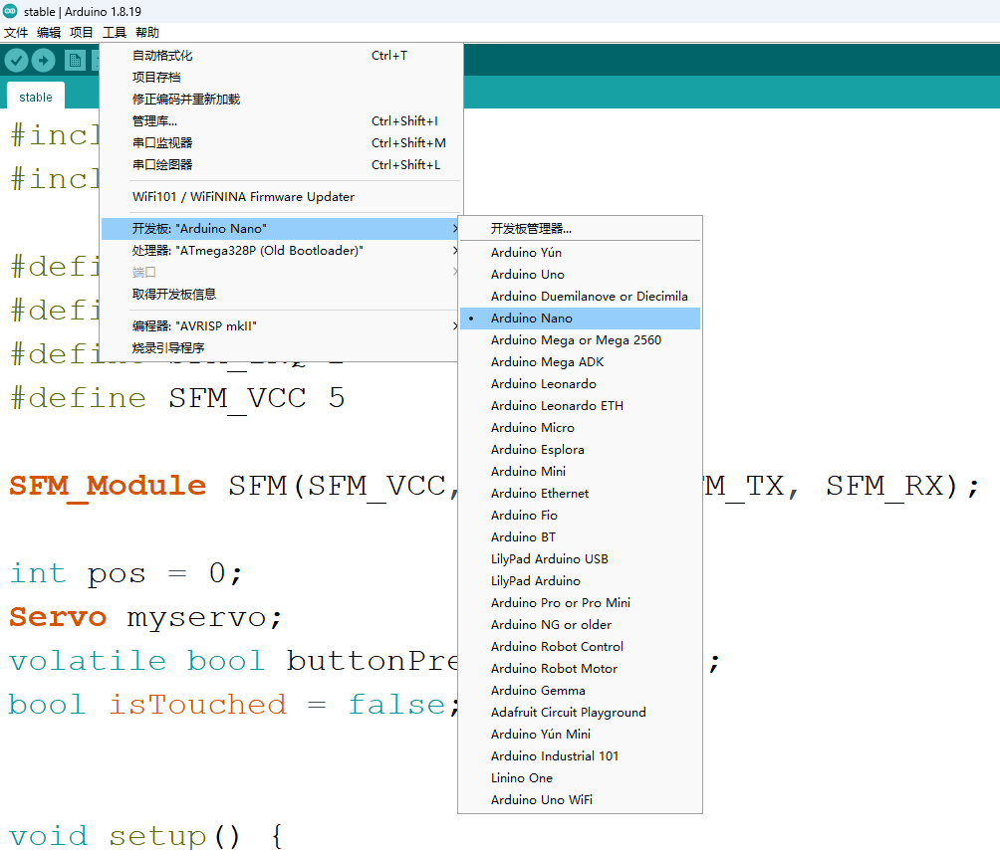

# 极易搭设的基于arduino和sfm_v1_7指纹门禁

## 特点
### 使用pcb板子作为arduino nano的外挂，接线都在这块板子上，nano板甚至可以直接拔掉，方便烧录。整体结构非常简洁美观，后续打算3d打印一个外壳（有能力的大佬也可以自己尝试）
### 使用typec作为供电，同时挂载3节18650并联以及电源模块，续航10天简简单单。可以选择换电池或者typec线一直接着
### 系统也最简化，只有门内外开门的功能，已经在搞以树莓派为核心的宿舍智能家居，该项目也会并入智能家居

## 硬件清单
|`````材料 `````|`````用途或来源````` |
| ------ | ------ |
| Arduino Nano |开发板  |
| sfm_v1_7 | 采集指纹 risym家的[指纹模块](https://m.tb.cn/h.UrSxzkz?tk=GeoWdQqVmTY)|
| MG996r舵机 | 用于带动门锁 我寝室是压把门所以用了大力舵机并且配上栓接工字钢，插销门可以直接MG90s |
| typec电源模块| [电源模块](https://m.tb.cn/h.UqFt8ye?tk=lLTkdQqTgjg) |
| 5v稳压模块|舵机会使供电电压产生波动，所以要稳压（小功率舵机可以不用）|
| 18650电池三节和配套并联电池盒|供能|
| pcb板子| 上面有两排排母，直接插到nano板上，元器件也直接放到上面，可以嘉立创免费白嫖。文件已经放到hardware文件夹， 可按需自行改动|
| 触摸模块|门内开门按键（不过因为是电容式，要做好隔离）|

*       所有模块满载功耗约为8瓦
        花费合计150元(时间2023.3)

## 效果展示





* 图中4节南孚电池为原有的刷卡门禁供电，以备不时之需

## 硬件
鉴于需要直接转动门轴，采用了更为牢固的工字钢和栓接，搭配亚克力激光切割齿轮组，如果方案类似也可采用此类方法；若仅需很小的力就能开门，这边建议热熔胶ab胶开粘就完了。


## 接线图


* 按照上图引脚定义接好pcb板子之后，把pcb板子直接扣在arduino nano上，如图
  


## 环境配置
Arduino IDE1.8.19

请装以下库文件:
工具-管理库(Ctrl+Shift+I):
搜索sfm_V1.7，下载最新的


烧录环境
